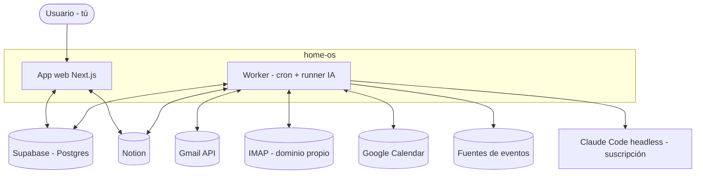
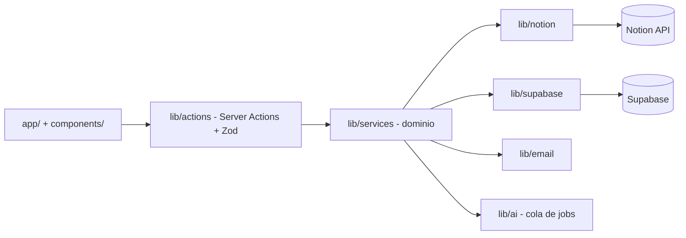

# 01 · Arquitectura (C4)

## Contexto (C1)

## Contenedores (C2)
| Contenedor | Tecnología | Responsabilidad |
|------------|-----------|-----------------|
| **App web** | Next.js 16 (App Router, RSC, Server Actions) | UI del dashboard, lectura desde Supabase, acciones del usuario |
| **Worker** | Node + tsx + node-cron | Sync Notion↔Supabase, polling de correo, descubrimiento de eventos, **runner IA** |
| **Supabase** | Postgres + Auth + RLS | Espejo de Notion, analítica, `ai_jobs`, cuentas de correo (cifradas), auth |
| **Runner IA** | Claude Code headless (`claude -p`) | Ejecuta tareas IA con la **suscripción** (sin API key) |
| **Notion** | API oficial | Superficie de edición / **importador** de registros (Fase B; antes fuente de verdad) |

## Componentes de la app (C3)

## Decisiones clave
- **Separación estricta de capas**: `app` → `actions` → `services` → `lib/*`. La lógica de negocio vive
  en `services`; el acceso a datos en `lib/*`. (Anti-patrón evitado: lógica dentro del CRUD de datos).
- **La app web no llama a la IA directamente**: encola en `ai_jobs`; el worker la procesa (desacople).
- **La UI lee de Supabase** (rápido, sin rate limits); Notion se sincroniza por el worker (híbrido).

## Decisión D-2026-06-27 · Supabase-nativo (Notion → importador)

**Contexto:** el modelo híbrido nació porque Notion era la herramienta de gestión ya hecha del dev (su
andamio). Pero Notion-como-fuente-de-verdad **no escala a multi-tenant**: no se puede exigir a cada
usuario tener su workspace de Notion con la integración montada.

**Decisión:** migrar a **Supabase-nativo** (la app es dueña de sus datos), por fases y sin romper prod:
- **Fase A** (hecha en su mayoría): todo concepto nuevo nace nativo en Supabase.
- **Fase B** (siguiente): `movimiento`/`deuda` pasan a **nativos**; las Server Actions de escritura escriben
  **directo en Supabase** (ya no en Notion). El sync deja de ser fuente de verdad y se vuelve **importador**
  que NO pisa lo creado en la app (distinguir `origen`: `notion | app`). Ver `transversal/integracion-notion.md`.
- **Fase C**: multi-tenant (auth multiusuario + RLS por usuario); Notion queda como integración **opcional**
  por usuario. Disparador: hay 2 testers listos para entrar con cuentas de prueba. Ver `modules/M7`.

**Consecuencia:** el modelo financiero nuevo (cuentas, tarjetas, gastos a plazos) se construye sobre esta
base nativa. Ver `modules/M1-finanzas.md`.
