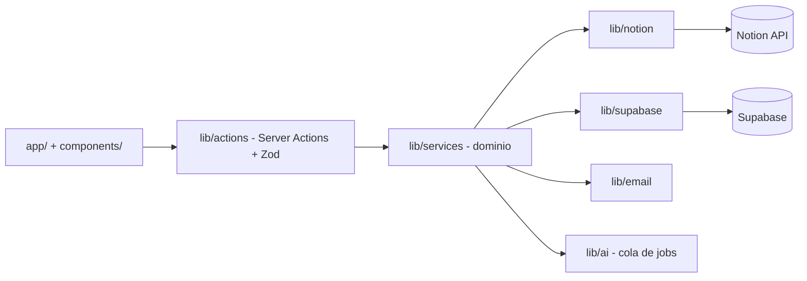

# 01 · Arquitectura (C4)

## Contexto (C1)

## Contenedores (C2)
| Contenedor | Tecnología | Responsabilidad |
|------------|-----------|-----------------|
| **App web** | Next.js 16 (App Router, RSC, Server Actions) | UI del dashboard, lectura desde Supabase, acciones del usuario |
| **Worker** | Node + tsx + node-cron | Sync Notion↔Supabase, polling de correo, descubrimiento de eventos, **runner IA** |
| **Supabase** | Postgres + Auth + RLS | Espejo de Notion, analítica, `ai_jobs`, cuentas de correo (cifradas), auth |
| **Runner IA** | Claude Code headless (`claude -p`) | Ejecuta tareas IA con la **suscripción** (sin API key) |
| **Notion** | API oficial | Superficie de edición / fuente de verdad de registros |

## Componentes de la app (C3)

## Decisiones clave
- **Separación estricta de capas**: `app` → `actions` → `services` → `lib/*`. La lógica de negocio vive
  en `services`; el acceso a datos en `lib/*`. (Anti-patrón evitado: lógica dentro del CRUD de datos).
- **La app web no llama a la IA directamente**: encola en `ai_jobs`; el worker la procesa (desacople).
- **La UI lee de Supabase** (rápido, sin rate limits); Notion se sincroniza por el worker (híbrido).
