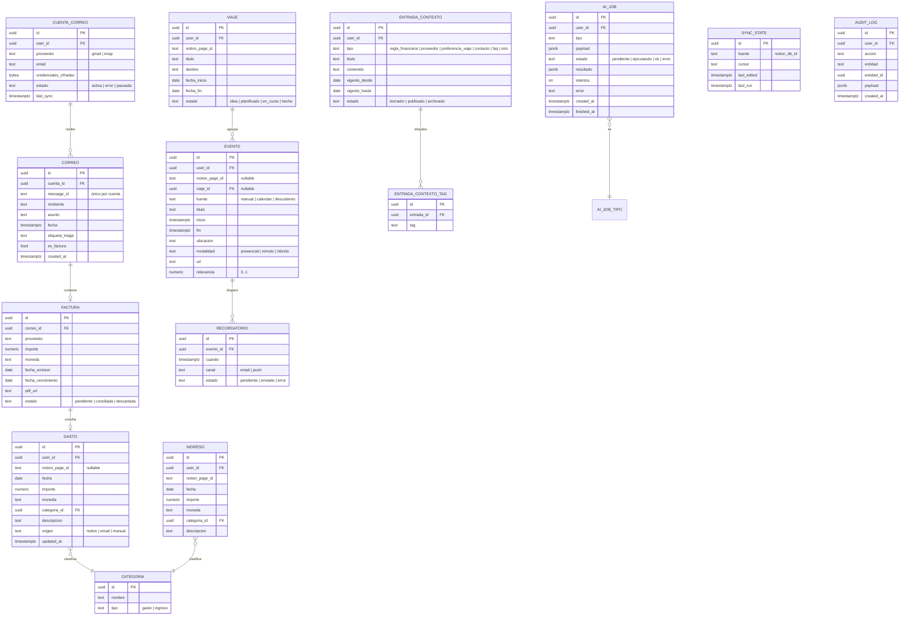

# 02 · Modelo de datos global (ER canónico)

Fuente **única de verdad** del modelo. Los módulos referencian estas entidades; no las redefinen.
Vive en **Supabase (Postgres)**. Las entidades con `notion_page_id` son **espejo híbrido** de Notion
(se editan en Notion, se sincronizan aquí). Todas llevan `user_id` para RLS (single-user, pero explícito).

## Notas de diseño
- **Híbrido Notion↔Supabase**: `GASTO`, `INGRESO`, `VIAJE`, `EVENTO`, `ENTRADA_CONTEXTO` pueden tener
  `notion_page_id`. `SYNC_STATE` guarda el cursor/last_edited por DB de Notion para sync incremental.
- **Idempotencia de correo**: único `(cuenta_id, message_id)` en `CORREO` → no se duplican facturas.
- **Conciliación**: `FACTURA.estado` + FK opcional `GASTO.factura_id` (1:1 lógico).
- **Banco de contexto**: `ENTRADA_CONTEXTO` + tags; recuperación por `tipo`/`tag`/vigencia (sin vectores de pago).
- **IA**: `AI_JOB` desacopla la app del runner; `resultado` validado con Zod antes de persistir.
- **Auditoría**: toda escritura relevante deja traza en `AUDIT_LOG`.
- **RLS**: todas las tablas con `user_id` filtran por el usuario autenticado (ver M7).
