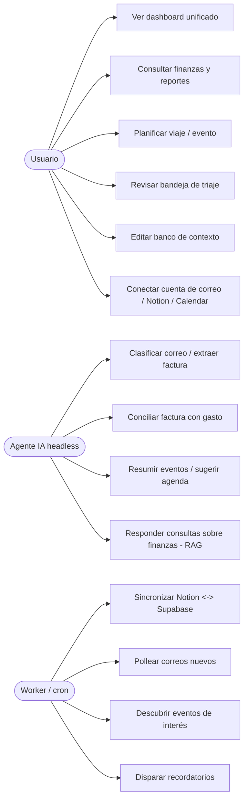
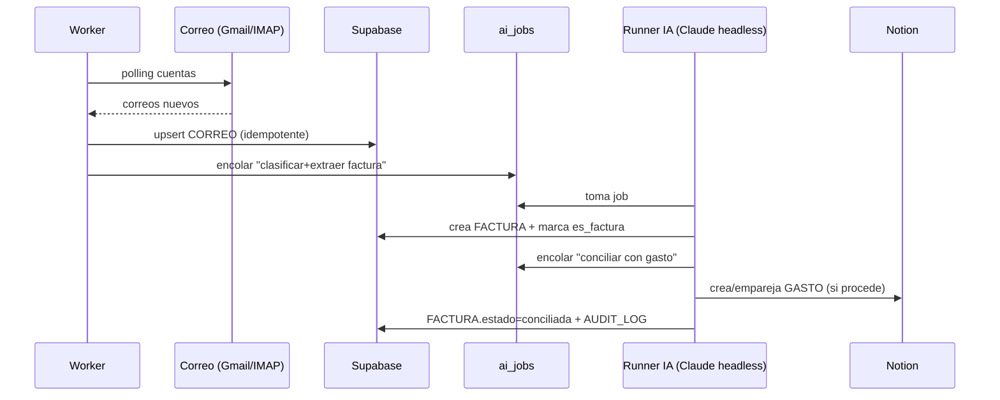

# 03 · Mapa de casos de uso

## Casos de uso → módulos
| UC | Caso de uso | Módulo(s) | Actor |
|----|-------------|-----------|-------|
| UC1 | Dashboard unificado | M5 | Usuario |
| UC2 | Finanzas y reportes | M1 | Usuario |
| UC3 | Planificar viaje/evento | M2 | Usuario |
| UC4 | Bandeja de triaje | M3 | Usuario |
| UC5 | Editar banco de contexto | M4 | Usuario |
| UC6 | Conectar integraciones (OAuth/IMAP/Notion) | M3, M7, T1–T3 | Usuario |
| UC7 | Sync Notion↔Supabase | M1, T1 | Worker |
| UC8 | Polling de correo | M3, T2 | Worker |
| UC9 | Descubrimiento de eventos | M2, T3 | Worker |
| UC10 | Recordatorios | M2 | Worker |
| UC11 | Clasificar/extraer factura | M3, M6 | IA |
| UC12 | Conciliar factura↔gasto | M1, M6 | IA |
| UC13 | Resumir/sugerir agenda | M2, M6 | IA |
| UC14 | RAG sobre finanzas/contexto | M4, M6 | IA |

## Flujo estrella: factura por correo → gasto conciliado

