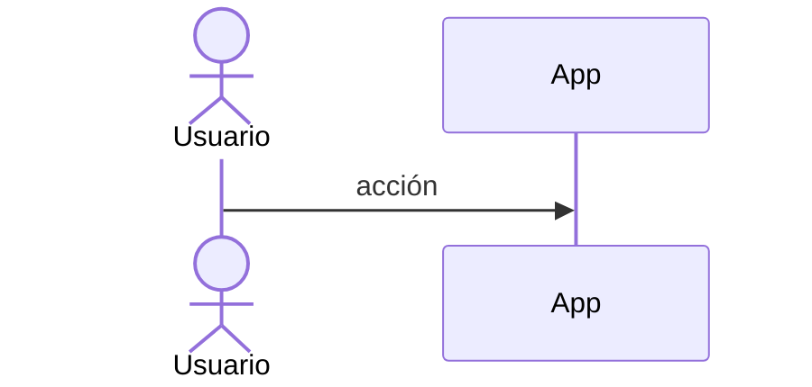
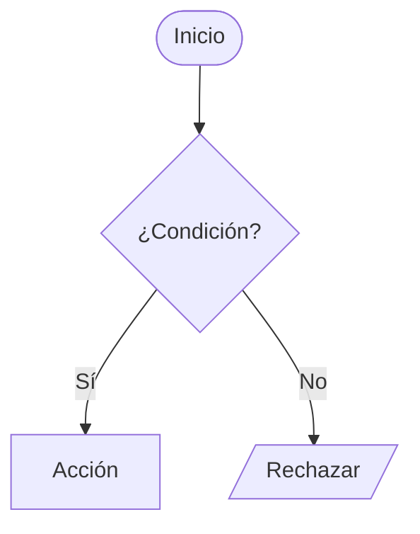

### F-Mx-N · [Nombre de la funcionalidad]

| Campo | Valor |
|-------|-------|
| **ID** | F-Mx-N · **Estado** 🟧 |

**Descripción/objetivo:** _qué hace y para qué._
**Actores y precondiciones:** _quién, qué debe cumplirse antes._

**Caso de uso (principal):**
1. …

**Secuencia:**

**Flujo / actividad:**

**Entidades:** _(lee/escribe)._
**Reglas/validaciones:** _Zod + invariantes._
**Endpoints/Server Actions/Jobs:** _…_
**Criterios de aceptación:**
- [ ] Dado … cuando … entonces …
**DoD (obligatorio):** Story + Test RTL del componente · tests de lógica (services/mappers) · DoD móvil (mobile-first) · `typecheck`+`lint`+`test` verdes.
**Dependencias:** _…_
