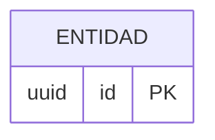

# Mx · [Nombre del módulo]

> Plantilla de **módulo**. Copiar a `modules/Mx-nombre.md` y rellenar. Borrar las notas en cursiva.

| Campo | Valor |
|-------|-------|
| **ID** | Mx |
| **Estado** | 🟧 borrador |
| **Depende de** | _Mx, My…_ |
| **Lo usan** | _Mx, My…_ |

## 1. Propósito y alcance
_Qué resuelve y qué queda explícitamente fuera._

## 2. Actores
_Usuario (single-user), agente IA headless, sistemas externos (Notion, Gmail/IMAP, Calendar)._

## 3. Requisitos funcionales (RF)
| ID | Requisito | Prioridad |
|----|-----------|:---------:|
| RF-Mx-001 | … | Must / Should / Could |

## 4. Requisitos no funcionales (RNF)
| ID | Requisito | Métrica / criterio |
|----|-----------|--------------------|
| RNF-Mx-001 | … | … |

## 5. Modelo de datos (fragmento del ER global)
_Solo entidades de este módulo. Referenciar el ER global, no redefinirlo._

## 6. Arquitectura / componentes
_Cómo encaja en el C4 y en las capas (`app` → `actions` → `services` → `lib/*`)._

## 7. Funcionalidades
_Cada una con la plantilla `funcionalidad.md`._

## 8. Endpoints / Server Actions / Integraciones / Jobs
| Tipo | Nombre | Entrada | Salida | Auth | Notas |
|------|--------|---------|--------|------|-------|

## 9. Componentes UI (Definition of Done)
| Componente | Story | Test RTL | Estado |
|------------|:-----:|:--------:|--------|

## 10. Criterios de aceptación del módulo
- [ ] …

## 11. DoD de cierre del módulo (obligatorio antes de marcar "hecho")
_Ver `docs/transversal/calidad-y-pruebas.md` y `docs/transversal/mobile-first.md`._
- [ ] Cada componente UI tiene **Story** (Storybook) **y Test RTL** co-locados.
- [ ] Lógica de `lib/services` y mappers de `lib/notion` con **tests unitarios**.
- [ ] **DoD móvil** cumplido (mobile-first: tablas, touch targets, sin scroll horizontal, light+dark).
- [ ] Flujos críticos con **E2E** (si aplica).
- [ ] Migraciones Supabase **aplicadas** en prod (si las hay).
- [ ] `typecheck` + `lint` + `test` + `build` en verde; `dod-coverage.test.ts` sin deuda nueva.
- [ ] Documentación del módulo y **estado en `CLAUDE.md`** actualizados.

## 12. Riesgos y decisiones abiertas
- …
