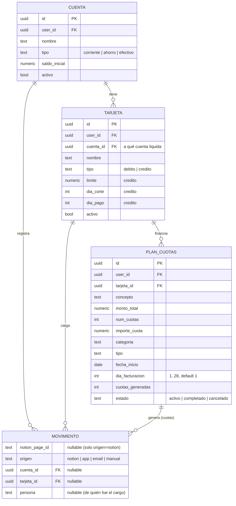
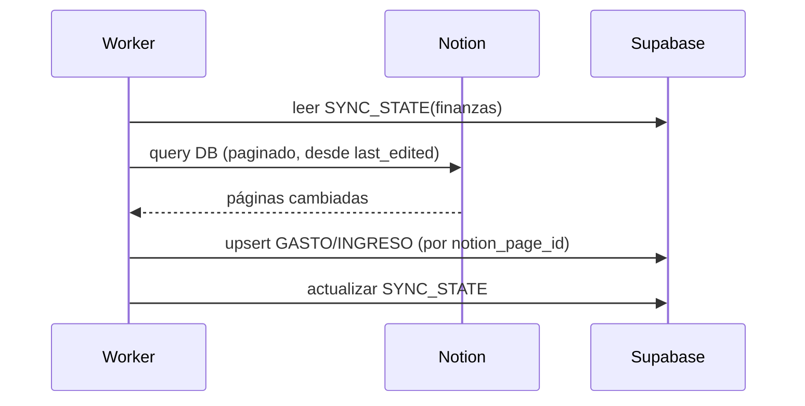
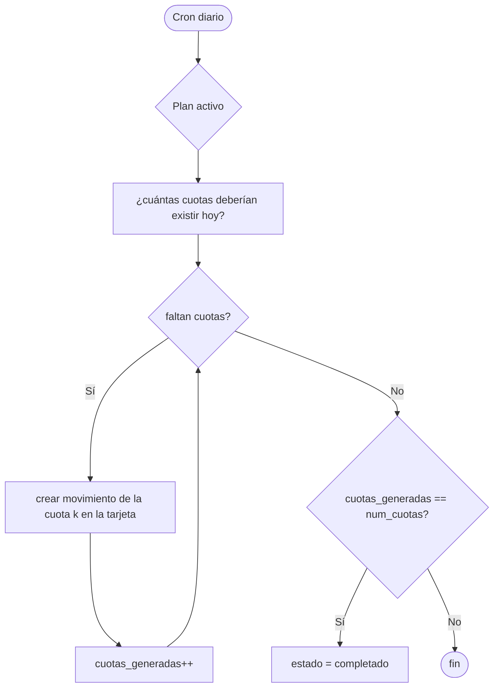

# M1 · Finanzas

| Campo | Valor |
|-------|-------|
| **ID** | M1 |
| **Estado** | 🟩 implementado (lectura + escritura; falta conciliación factura↔gasto de M3/M6) |
| **Depende de** | T1 (Notion), M3 (correo/facturas), M7 (auth), Supabase |
| **Lo usan** | M5 (dashboard), M6 (IA: conciliación/RAG) |

> **Implementado (2026-06-21):** sync Notion→Supabase (lectura) + **escritura a Notion** desde la app:
> editar `status` (Pendiente/Pagado), alta de gastos/deudas con **firma de importe** (gasto/deuda negativo,
> ingreso positivo), subida de **factura/comprobante** a Storage público + enlace externo en Notion, y **sync
> manual**. Deudas = **saldo neto por persona** (deuda negativa + pagos positivos → pendiente / por cobrar).
> Tabla de **movimientos** con búsqueda, filtros (tipo/categoría/estado), orden por columnas y "cargar más".
> Capa de escritura Notion: `lib/notion/{mutations,properties-write}.ts`. Migración `0003_finanzas_write.sql`.
>
> **Backlog / mejoras sugeridas (no implementadas):**
> - Filtro por **mes / rango de fechas** en movimientos (hoy: tipo/categoría/estado/búsqueda).
> - **Exportar** movimientos (CSV).
> - **Conciliación factura↔gasto** (requiere M3/M6).
> - Paginación server-side si el volumen crece (hoy es client-side en memoria, suficiente single-user).

> **Dirección 2026-06-27 — modelo financiero nativo (Fase B).** Tras la decisión Supabase-nativo
> (`00-overview/01-arquitectura-c4.md`), M1 deja de depender de Notion como fuente de verdad: las
> escrituras van **directo a Supabase** y Notion queda como **importador**. Sobre esa base se construye un
> modelo financiero más rico (origen del feedback de usuarios): **cuentas de banco**, **tarjetas
> débito/crédito** (el crédito como saldo rotatorio que pagas luego), **atribución por persona** (tarjetas
> compartidas), y **gastos a plazos** (cuotas como cargos de tarjeta de crédito generados por el worker).
> Ver §3 (RF-M1-008+), §5.1 (modelo nativo) y §7 (F-M1-5..8). Orden de build: groundwork Fase B → cuentas/
> tarjetas/etiquetado → gastos a plazos → refinos (extracto, costo de vida, presupuestos).

## 1. Propósito y alcance
Centralizar las finanzas personales: leer/escribir las **DBs de finanzas de Notion**, espejarlas en
Supabase para **analítica y reportes** rápidos, e **ingerir facturas** detectadas en el correo (M3),
conciliándolas con gastos.

**Dentro:** gastos/ingresos (nativos en Supabase; Notion como importador); categorización; reportes (por
mes/categoría); conciliación factura↔gasto; **cuentas de banco**, **tarjetas débito/crédito**, **atribución
por persona** y **gastos a plazos** (§5.1, §7). **Fuera:** pasarela de pagos real; la lectura cruda del
correo (es M3); presupuestos y costo de vida quedan como RF "Could" a diseñar (RF-M1-013/014).

## 2. Actores
Usuario; Worker (sync); Agente IA headless (conciliación, consultas RAG).

## 3. Requisitos funcionales (RF)
| ID | Requisito | Prioridad |
|----|-----------|:---------:|
| RF-M1-001 | Sincronizar gastos e ingresos entre Notion y Supabase (incremental, bidireccional controlado). | Must |
| RF-M1-002 | Listar/filtrar gastos e ingresos por fecha, categoría, importe y origen. | Must |
| RF-M1-003 | Reportes: total por mes, por categoría, balance ingresos−gastos, tendencia. | Must |
| RF-M1-004 | Conciliar una factura (de M3) con un gasto (crear o emparejar). | Must |
| RF-M1-005 | Crear/editar un gasto o ingreso desde home-os y reflejarlo en Notion. | Should |
| RF-M1-006 | Detección de duplicados y de gastos recurrentes. | Should |
| RF-M1-007 | Exportar (CSV) un periodo. | Could |
| RF-M1-008 | Gestionar **cuentas de banco** (corriente/ahorro/efectivo) y ver **balance por cuenta**. | Should |
| RF-M1-009 | Gestionar **tarjetas** (débito/crédito); para crédito, ver **cuánto se pagará** (cargos no liquidados). | Should |
| RF-M1-010 | Etiquetar cada movimiento con **cuenta**, **tarjeta** y **persona** (opcionales). | Should |
| RF-M1-011 | **Gastos a plazos**: plan de N cuotas en una tarjeta; el worker genera la cuota de cada mes. | Should |
| RF-M1-012 | **Descomposición por persona** de una tarjeta compartida (cuánto del extracto es de cada uno). | Should |
| RF-M1-013 | Indicador de **costo de vida** (definir métrica: gasto fijo recurrente / media mensual). | Could |
| RF-M1-014 | **Presupuestos** por categoría/mes con seguimiento. | Could |

## 4. Requisitos no funcionales (RNF)
| ID | Requisito | Métrica |
|----|-----------|---------|
| RNF-M1-001 | Reportes rápidos | Se leen de Supabase, no de Notion (< 300 ms típicos). |
| RNF-M1-002 | Sync robusto | Rate-limit + retry; reanudable por cursor (`SYNC_STATE`). |
| RNF-M1-003 | Consistencia | Sin duplicar registros en re-sync (clave `notion_page_id`). |
| RNF-M1-004 | Trazabilidad | Conciliaciones y escrituras a Notion → `AUDIT_LOG`. |

## 5. Modelo de datos (fragmento) — schema REAL de Notion

La DB de Notion confirmó el modelo (página *Finances* → 2 bases):

**`Presupuesto`** (una sola tabla para ingresos y gastos) → dominio **`Movimiento`**:
| Notion | Tipo | Dominio | Notas |
|--------|------|---------|-------|
| `Name` | title | `nombre` | |
| `Date` | date | `fecha` | |
| `amount` | number (€) | `importe` | **firmado**: gastos en negativo |
| `category` | select | `categoria` | Salario, Casa, Desarrollo, Osio, Confort, Viaje, Medicina, Transporte, Restaurantes, Comida, Deuda |
| `type` | select | `tipo` | Gasto Fijo/Variable/Hormiga, Ingreso Fijo/Variable, Deuda |
| `status` | status | `estado` | Pending / Done |
| `invoices` | files | `facturas` | **las facturas ya van adjuntas aquí** (impacta M3: parte de la "conciliación" ya está en Notion) |

`flujo` (`ingreso`/`gasto`/`deuda`) se **deriva** de `type`. `balance` = suma firmada de todos los importes.

**`Deudas_Personales`** → dominio **`Deuda`**: `Deuda`(title)→`concepto`, `Fecha de Creación`(date),
`Valor`(number €), `Persona_A_Pagar_Cobrar`(select: Tia Anay, RafaYDay, Leo, Guille).

> En Supabase el espejo será `MOVIMIENTO` + `DEUDA` (no `GASTO`/`INGRESO` separados): coincide con cómo
> trabajas en Notion. `notion_page_id` como clave de upsert; `SYNC_STATE` para el sync incremental.

### Estado de implementación (T1 hecho)
- ✅ Capa Notion (`client`, `schema`, `paginate`, `rate-limit`, `properties`, `mappers`).
- ✅ `src/types/finanzas.ts` (`Movimiento`, `Deuda` + Zod), `lib/services/finanzas.ts` (`listMovimientos`/`listDeudas`/`resumen`).
- ✅ `/finanzas` lee **en vivo** de Notion (interim) — verificado end-to-end. Tests: mappers + resumen.
- ⏭️ Pendiente: sync a Supabase (requiere credenciales Supabase) → la UI pasará a leer de Supabase.

### 5.1 · Modelo financiero nativo (Fase B+)

Entidades **nativas de Supabase** (no espejo de Notion). `movimiento` (hoy espejo) gana `origen`
(`notion | app | email | manual`) y vínculos opcionales a cuenta/tarjeta/persona.

**Invariantes clave:**
- **Débito**: el cargo reduce el saldo de la `cuenta` ya. **Crédito**: el cargo NO toca el banco; sube lo que
  se debe en la `tarjeta`; pagar el extracto (un movimiento desde la cuenta) lo baja.
- **Balance por cuenta** = `saldo_inicial` + Σ movimientos de esa cuenta (débito y pagos de extracto).
- **A pagar de una tarjeta de crédito** = Σ cargos a crédito de esa tarjeta no cubiertos aún por un pago de extracto.
- **Gasto por persona** = Σ movimientos filtrando `persona` (clave en tarjetas compartidas). Puente futuro:
  un cargo con `persona ≠ yo` puede enlazar a una `DEUDA` (esa persona me debe).
- **Cuota i** de un plan = un `movimiento` (cargo en la tarjeta) fechado en el mes i el `dia_facturacion`,
  nombre `"<concepto> (i/N)"`, `importe_cuota` (la última absorbe el redondeo), `origen=app`.

## 6. Arquitectura / componentes
- `lib/notion/sync/finanzas.ts` — pull incremental de las DBs de finanzas (cursor en `SYNC_STATE`).
- `lib/services/finanzas.ts` — reportes, conciliación, detección de duplicados/recurrentes.
- `lib/actions/finanzas.ts` — crear/editar gasto/ingreso (Zod) → Notion + Supabase.
- UI: `app/(dashboard)/finanzas` + componentes de tabla/gráficas.

## 7. Funcionalidades
- **F-M1-1 · Sync Notion↔Supabase** — pull incremental por cursor; upsert por `notion_page_id`; escritura a Notion en acciones del usuario. **Mark-and-sweep de borrados:** lo que ya no viene de Notion se marca `deleted_at` (soft-delete); la UI lee solo activos (`deleted_at is null`). Guarda anti-borrado masivo: el barrido no corre si el query trajo 0 registros. Migración `0004_soft_delete.sql`.
- **F-M1-2 · Reportes y analítica** — agregados por mes/categoría/balance (vistas SQL en Supabase).
- **F-M1-3 · Conciliación factura↔gasto** — empareja por importe+fecha+proveedor; si no hay match, crea gasto; deja `FACTURA.estado=conciliada`. (Usa M6 para el matching difuso.)
- **F-M1-4 · Alta/edición manual** — formulario con Zod; refleja en Notion.

### F-M1-5 · Cuentas de banco

| Campo | Valor |
|-------|-------|
| **ID** | F-M1-5 · **Estado** 🟧 |

**Descripción/objetivo:** gestionar cuentas (corriente/ahorro/efectivo) y ver el **balance por cuenta**.
**Actores y precondiciones:** usuario autenticado.
**Caso de uso:** crear/editar/archivar cuenta; el dashboard muestra balance = saldo_inicial + movimientos.
**Entidades:** `cuenta` (escribe), `movimiento` (lee, por `cuenta_id`).
**Reglas/validaciones:** Zod (nombre 1..80, tipo enum, saldo_inicial number). No borrar cuenta con movimientos → archivar.
**Server Actions:** `crearCuenta` / `editarCuenta` / `archivarCuenta` (Supabase nativo).
**Criterios de aceptación:** [ ] el balance de la cuenta cuadra con la suma de sus movimientos.
**DoD:** Story + Test RTL de la UI de cuentas · test de la agregación de balance · DoD móvil · verdes.
**Dependencias:** Fase B groundwork (origen nativo).

### F-M1-6 · Tarjetas (débito/crédito)

| Campo | Valor |
|-------|-------|
| **ID** | F-M1-6 · **Estado** 🟧 |

**Descripción/objetivo:** gestionar tarjetas y, para crédito, ver **cuánto se pagará** (cargos no liquidados).
**Actores y precondiciones:** usuario; una `cuenta` a la que la tarjeta liquida.
**Caso de uso:** crear tarjeta (tipo débito/crédito, cuenta, límite y días de corte/pago si crédito); resúmenes por tarjeta.
**Entidades:** `tarjeta` (escribe), `cuenta` (lee), `movimiento` (lee, por `tarjeta_id`).
**Reglas/validaciones:** crédito requiere `limite`/`dia_corte`; débito no. Crédito = saldo rotatorio (cargos suben, pagos bajan).
**Server Actions:** `crearTarjeta` / `editarTarjeta` / `archivarTarjeta`; agregación `saldoTarjetaCredito`.
**Criterios de aceptación:** [ ] "a pagar" de una tarjeta de crédito = Σ cargos a crédito no cubiertos por pago de extracto.
**DoD:** Story + Test RTL · test de la agregación de saldo de crédito · DoD móvil · verdes.
**Dependencias:** F-M1-5.

### F-M1-7 · Etiquetado de movimientos (cuenta / tarjeta / persona)

| Campo | Valor |
|-------|-------|
| **ID** | F-M1-7 · **Estado** 🟧 |

**Descripción/objetivo:** asociar cada movimiento (opcionalmente) a una cuenta, una tarjeta y una **persona**.
La persona es clave para **tarjetas compartidas**: descomponer el extracto por quién hizo cada cargo.
**Actores y precondiciones:** usuario; movimiento existente o en alta.
**Caso de uso:** al crear/editar un movimiento, elegir cuenta/tarjeta/persona; ver "gasto por persona".
**Entidades:** `movimiento` (escribe `cuenta_id`/`tarjeta_id`/`persona`).
**Reglas/validaciones:** vínculos opcionales; `persona` texto libre con sugerencias (reutiliza `PERSONAS_DEUDA`).
**Server Actions:** extender `crearMovimiento`/`editarMovimiento` (nativo) con estos campos.
**Criterios de aceptación:** [ ] el extracto de una tarjeta compartida se descompone por persona y la suma cuadra.
**DoD:** Story + Test RTL de los selectores · test de la agregación por persona · DoD móvil · verdes.
**Dependencias:** F-M1-5, F-M1-6, Fase B.
**Nota:** puente futuro `persona`↔`DEUDA` (un cargo de otra persona = deuda suya conmigo).

### F-M1-8 · Gastos a plazos (plan de cuotas)

| Campo | Valor |
|-------|-------|
| **ID** | F-M1-8 · **Estado** 🟧 |

**Descripción/objetivo:** registrar una compra a crédito troceada en N cuotas mensuales; el worker genera
la cuota de cada mes automáticamente (el día 1 o el `dia_facturacion` indicado).
**Actores y precondiciones:** usuario; una `tarjeta` (normalmente de crédito).
**Caso de uso:**
1. El usuario crea el plan (concepto, monto total, nº cuotas, tarjeta, categoría, tipo, fecha inicio, día de facturación).
2. Se genera la **cuota 1** al instante; el resto, cada mes, las crea el worker.
3. Cada cuota es un `movimiento` (cargo en la tarjeta) que se marca pagado por separado.

**Flujo (cron del worker):**

**Entidades:** `plan_cuotas` (escribe), `movimiento` (crea cuotas, `origen=app`, `tarjeta_id`).
**Reglas/validaciones:** Zod (monto_total>0, num_cuotas 2..120, dia_facturacion 1..28 default 1). Redondeo: la
última cuota absorbe los céntimos (Σ cuotas = monto_total exacto). **Idempotencia** vía `cuotas_generadas`
(catch-up si el worker estuvo caído; sin duplicar).
**Server Actions / Jobs:** `crearPlanCuotas` (usuario); `generarCuotasPendientes` (job worker, cron diario).
**Criterios de aceptación:**
- [ ] Un plan de 1000€/10 genera 10 cuotas de 100€ fechadas mes a mes, sin duplicar en reruns.
- [ ] Si el worker estuvo caído, al volver genera las cuotas atrasadas (catch-up).
**DoD:** Story + Test RTL del formulario · **tests de la lógica pura** (cuotas debidas, redondeo, catch-up) ·
DoD móvil · verdes.
**Dependencias:** F-M1-6 (tarjeta), Fase B, cron en el worker.

## 8. Endpoints / Server Actions / Jobs
| Tipo | Nombre | Entrada | Salida | Auth |
|------|--------|---------|--------|------|
| Job | `syncFinanzas` | — | upserts | worker |
| Server Action | `crearGasto/editarGasto` | datos (Zod) | registro | usuario |
| Server Action | `conciliarFactura` | factura_id, gasto_id? | estado | usuario/IA |
| Server Action | `crearCuenta/editarCuenta/archivarCuenta` | datos (Zod) | cuenta | usuario |
| Server Action | `crearTarjeta/editarTarjeta/archivarTarjeta` | datos (Zod) | tarjeta | usuario |
| Server Action | `crearPlanCuotas` | datos (Zod) | plan + cuota 1 | usuario |
| Job | `generarCuotasPendientes` | — | cuotas creadas | worker (cron diario) |

## 9. Componentes UI (DoD)
Story + Test RTL co-locados (ver `docs/transversal/calidad-y-pruebas.md`). El enforcement vive en
`src/components/dod-coverage.test.ts` (`DEUDA_STORY` / `DEUDA_TEST`, hoy vacías).
| Componente | Story | Test RTL | Estado |
|------------|:-----:|:--------:|--------|
| `movimientos-table` (filtros/orden/reflow móvil) | ✅ | ✅ | ✅ |
| `nuevo-movimiento` (alta) | ✅ | ✅ | ✅ |
| `nueva-deuda` (alta) | ✅ | ✅ | ✅ |
| `estado-toggle` | ✅ | ✅ | ✅ |
| `archivos-cell` (subida) | ✅ | ✅ | ✅ |
| `sync-button` | ✅ | ✅ | ✅ |
| `bar-list` | ✅ | ✅ | ✅ |
| `borrar-button` (UI + asistente) | ✅ | ✅ | ✅ |
| `DialogoConciliacion` (M3/M6) | ⬜ | ⬜ | pendiente |
| Gestión de `cuentas` (F-M1-5) | ⬜ | ⬜ | pendiente |
| Gestión de `tarjetas` (F-M1-6) | ⬜ | ⬜ | pendiente |
| Selectores cuenta/tarjeta/persona (F-M1-7) | ⬜ | ⬜ | pendiente |
| `nuevo-plan-cuotas` (F-M1-8) | ⬜ | ⬜ | pendiente |

## 10. Criterios de aceptación
- [ ] Re-sincronizar no duplica registros.
- [ ] Los reportes salen de Supabase y cuadran con Notion.
- [ ] Una factura de M3 se concilia (match o alta) y queda auditada.

## 11. Riesgos y decisiones abiertas
- Mapear el **schema real** de tus DBs de finanzas en Notion (nombres/tipos de columnas) → schema registry (T1).
- Definir reglas de categorización y de recurrencia (pueden vivir en el banco de contexto, M4).
- Política de escritura a Notion (¿qué campos puede escribir home-os para evitar conflictos de edición?).
- **Migración Fase B**: cómo conviven los movimientos `origen=notion` ya existentes con los `origen=app`
  nuevos; el sync importador no debe pisarlos. Migración para añadir `origen`/`cuenta_id`/`tarjeta_id`/`persona`.
- **KPI con cuotas futuras**: las cuotas se fechan en su mes (vista por-mes exacta). Decidir si el total
  global "Gastos" cuenta solo lo vencido (fecha ≤ hoy) o incluye lo comprometido. (Pendiente al implementar.)
- **Costo de vida (RF-M1-013)**: definir la métrica (gasto fijo recurrente vs media móvil vs categorías esenciales).
- **Presupuestos (RF-M1-014)**: alcance (por categoría/mes; alertas al superar) — lluvia de ideas pendiente.
