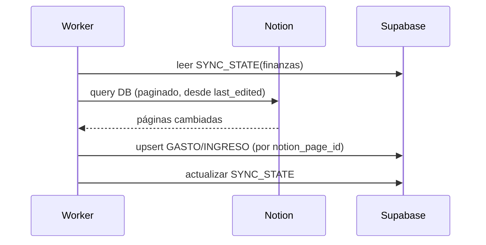

# M1 · Finanzas

| Campo | Valor |
|-------|-------|
| **ID** | M1 |
| **Estado** | 🟩 implementado (lectura + escritura; falta conciliación factura↔gasto de M3/M6) |
| **Depende de** | T1 (Notion), M3 (correo/facturas), M7 (auth), Supabase |
| **Lo usan** | M5 (dashboard), M6 (IA: conciliación/RAG) |

> **Implementado (2026-06-21):** sync Notion→Supabase (lectura) + **escritura a Notion** desde la app:
> editar `status` (Pendiente/Pagado), alta de gastos/deudas con **firma de importe** (gasto/deuda negativo,
> ingreso positivo), subida de **factura/comprobante** a Storage público + enlace externo en Notion, y **sync
> manual**. Deudas = **saldo neto por persona** (deuda negativa + pagos positivos → pendiente / por cobrar).
> Tabla de **movimientos** con búsqueda, filtros (tipo/categoría/estado), orden por columnas y "cargar más".
> Capa de escritura Notion: `lib/notion/{mutations,properties-write}.ts`. Migración `0003_finanzas_write.sql`.
>
> **Backlog / mejoras sugeridas (no implementadas):**
> - Filtro por **mes / rango de fechas** en movimientos (hoy: tipo/categoría/estado/búsqueda).
> - **Exportar** movimientos (CSV).
> - **Conciliación factura↔gasto** (requiere M3/M6).
> - Paginación server-side si el volumen crece (hoy es client-side en memoria, suficiente single-user).

## 1. Propósito y alcance
Centralizar las finanzas personales: leer/escribir las **DBs de finanzas de Notion**, espejarlas en
Supabase para **analítica y reportes** rápidos, e **ingerir facturas** detectadas en el correo (M3),
conciliándolas con gastos.

**Dentro:** sync de gastos/ingresos Notion↔Supabase; categorización; reportes (por mes/categoría);
conciliación factura↔gasto. **Fuera:** pasarela de pagos; la lectura cruda del correo (es M3).

## 2. Actores
Usuario; Worker (sync); Agente IA headless (conciliación, consultas RAG).

## 3. Requisitos funcionales (RF)
| ID | Requisito | Prioridad |
|----|-----------|:---------:|
| RF-M1-001 | Sincronizar gastos e ingresos entre Notion y Supabase (incremental, bidireccional controlado). | Must |
| RF-M1-002 | Listar/filtrar gastos e ingresos por fecha, categoría, importe y origen. | Must |
| RF-M1-003 | Reportes: total por mes, por categoría, balance ingresos−gastos, tendencia. | Must |
| RF-M1-004 | Conciliar una factura (de M3) con un gasto (crear o emparejar). | Must |
| RF-M1-005 | Crear/editar un gasto o ingreso desde home-os y reflejarlo en Notion. | Should |
| RF-M1-006 | Detección de duplicados y de gastos recurrentes. | Should |
| RF-M1-007 | Exportar (CSV) un periodo. | Could |

## 4. Requisitos no funcionales (RNF)
| ID | Requisito | Métrica |
|----|-----------|---------|
| RNF-M1-001 | Reportes rápidos | Se leen de Supabase, no de Notion (< 300 ms típicos). |
| RNF-M1-002 | Sync robusto | Rate-limit + retry; reanudable por cursor (`SYNC_STATE`). |
| RNF-M1-003 | Consistencia | Sin duplicar registros en re-sync (clave `notion_page_id`). |
| RNF-M1-004 | Trazabilidad | Conciliaciones y escrituras a Notion → `AUDIT_LOG`. |

## 5. Modelo de datos (fragmento) — schema REAL de Notion

La DB de Notion confirmó el modelo (página *Finances* → 2 bases):

**`Presupuesto`** (una sola tabla para ingresos y gastos) → dominio **`Movimiento`**:
| Notion | Tipo | Dominio | Notas |
|--------|------|---------|-------|
| `Name` | title | `nombre` | |
| `Date` | date | `fecha` | |
| `amount` | number (€) | `importe` | **firmado**: gastos en negativo |
| `category` | select | `categoria` | Salario, Casa, Desarrollo, Osio, Confort, Viaje, Medicina, Transporte, Restaurantes, Comida, Deuda |
| `type` | select | `tipo` | Gasto Fijo/Variable/Hormiga, Ingreso Fijo/Variable, Deuda |
| `status` | status | `estado` | Pending / Done |
| `invoices` | files | `facturas` | **las facturas ya van adjuntas aquí** (impacta M3: parte de la "conciliación" ya está en Notion) |

`flujo` (`ingreso`/`gasto`/`deuda`) se **deriva** de `type`. `balance` = suma firmada de todos los importes.

**`Deudas_Personales`** → dominio **`Deuda`**: `Deuda`(title)→`concepto`, `Fecha de Creación`(date),
`Valor`(number €), `Persona_A_Pagar_Cobrar`(select: Tia Anay, RafaYDay, Leo, Guille).

> En Supabase el espejo será `MOVIMIENTO` + `DEUDA` (no `GASTO`/`INGRESO` separados): coincide con cómo
> trabajas en Notion. `notion_page_id` como clave de upsert; `SYNC_STATE` para el sync incremental.

### Estado de implementación (T1 hecho)
- ✅ Capa Notion (`client`, `schema`, `paginate`, `rate-limit`, `properties`, `mappers`).
- ✅ `src/types/finanzas.ts` (`Movimiento`, `Deuda` + Zod), `lib/services/finanzas.ts` (`listMovimientos`/`listDeudas`/`resumen`).
- ✅ `/finanzas` lee **en vivo** de Notion (interim) — verificado end-to-end. Tests: mappers + resumen.
- ⏭️ Pendiente: sync a Supabase (requiere credenciales Supabase) → la UI pasará a leer de Supabase.

## 6. Arquitectura / componentes
- `lib/notion/sync/finanzas.ts` — pull incremental de las DBs de finanzas (cursor en `SYNC_STATE`).
- `lib/services/finanzas.ts` — reportes, conciliación, detección de duplicados/recurrentes.
- `lib/actions/finanzas.ts` — crear/editar gasto/ingreso (Zod) → Notion + Supabase.
- UI: `app/(dashboard)/finanzas` + componentes de tabla/gráficas.

## 7. Funcionalidades
- **F-M1-1 · Sync Notion↔Supabase** — pull incremental por cursor; upsert por `notion_page_id`; escritura a Notion en acciones del usuario. **Mark-and-sweep de borrados:** lo que ya no viene de Notion se marca `deleted_at` (soft-delete); la UI lee solo activos (`deleted_at is null`). Guarda anti-borrado masivo: el barrido no corre si el query trajo 0 registros. Migración `0004_soft_delete.sql`.
- **F-M1-2 · Reportes y analítica** — agregados por mes/categoría/balance (vistas SQL en Supabase).
- **F-M1-3 · Conciliación factura↔gasto** — empareja por importe+fecha+proveedor; si no hay match, crea gasto; deja `FACTURA.estado=conciliada`. (Usa M6 para el matching difuso.)
- **F-M1-4 · Alta/edición manual** — formulario con Zod; refleja en Notion.

## 8. Endpoints / Server Actions / Jobs
| Tipo | Nombre | Entrada | Salida | Auth |
|------|--------|---------|--------|------|
| Job | `syncFinanzas` | — | upserts | worker |
| Server Action | `crearGasto/editarGasto` | datos (Zod) | registro | usuario |
| Server Action | `conciliarFactura` | factura_id, gasto_id? | estado | usuario/IA |

## 9. Componentes UI (DoD)
| Componente | Test RTL | Estado |
|------------|:--------:|--------|
| `TablaMovimientos` (filtros) | ⬜ | ⬜ |
| `ResumenFinanciero` (KPIs) | ⬜ | ⬜ |
| `GraficaGastosPorCategoria` | ⬜ | ⬜ |
| `DialogoConciliacion` | ⬜ | ⬜ |

## 10. Criterios de aceptación
- [ ] Re-sincronizar no duplica registros.
- [ ] Los reportes salen de Supabase y cuadran con Notion.
- [ ] Una factura de M3 se concilia (match o alta) y queda auditada.

## 11. Riesgos y decisiones abiertas
- Mapear el **schema real** de tus DBs de finanzas en Notion (nombres/tipos de columnas) → schema registry (T1).
- Definir reglas de categorización y de recurrencia (pueden vivir en el banco de contexto, M4).
- Política de escritura a Notion (¿qué campos puede escribir home-os para evitar conflictos de edición?).
