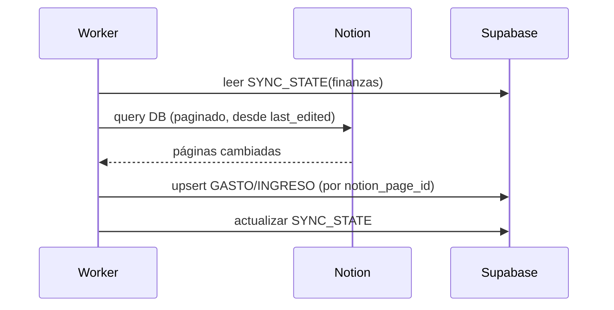

# M1 · Finanzas

| Campo | Valor |
|-------|-------|
| **ID** | M1 |
| **Estado** | 🟧 borrador |
| **Depende de** | T1 (Notion), M3 (correo/facturas), M7 (auth), Supabase |
| **Lo usan** | M5 (dashboard), M6 (IA: conciliación/RAG) |

## 1. Propósito y alcance
Centralizar las finanzas personales: leer/escribir las **DBs de finanzas de Notion**, espejarlas en
Supabase para **analítica y reportes** rápidos, e **ingerir facturas** detectadas en el correo (M3),
conciliándolas con gastos.

**Dentro:** sync de gastos/ingresos Notion↔Supabase; categorización; reportes (por mes/categoría);
conciliación factura↔gasto. **Fuera:** pasarela de pagos; la lectura cruda del correo (es M3).

## 2. Actores
Usuario; Worker (sync); Agente IA headless (conciliación, consultas RAG).

## 3. Requisitos funcionales (RF)
| ID | Requisito | Prioridad |
|----|-----------|:---------:|
| RF-M1-001 | Sincronizar gastos e ingresos entre Notion y Supabase (incremental, bidireccional controlado). | Must |
| RF-M1-002 | Listar/filtrar gastos e ingresos por fecha, categoría, importe y origen. | Must |
| RF-M1-003 | Reportes: total por mes, por categoría, balance ingresos−gastos, tendencia. | Must |
| RF-M1-004 | Conciliar una factura (de M3) con un gasto (crear o emparejar). | Must |
| RF-M1-005 | Crear/editar un gasto o ingreso desde home-os y reflejarlo en Notion. | Should |
| RF-M1-006 | Detección de duplicados y de gastos recurrentes. | Should |
| RF-M1-007 | Exportar (CSV) un periodo. | Could |

## 4. Requisitos no funcionales (RNF)
| ID | Requisito | Métrica |
|----|-----------|---------|
| RNF-M1-001 | Reportes rápidos | Se leen de Supabase, no de Notion (< 300 ms típicos). |
| RNF-M1-002 | Sync robusto | Rate-limit + retry; reanudable por cursor (`SYNC_STATE`). |
| RNF-M1-003 | Consistencia | Sin duplicar registros en re-sync (clave `notion_page_id`). |
| RNF-M1-004 | Trazabilidad | Conciliaciones y escrituras a Notion → `AUDIT_LOG`. |

## 5. Modelo de datos (fragmento)
`GASTO`, `INGRESO`, `CATEGORIA`, `FACTURA` (de M3), `SYNC_STATE`. Ver ER global.
Clave: `GASTO.notion_page_id` (espejo) + `GASTO.factura_id` (conciliación 1:1).

## 6. Arquitectura / componentes
- `lib/notion/sync/finanzas.ts` — pull incremental de las DBs de finanzas (cursor en `SYNC_STATE`).
- `lib/services/finanzas.ts` — reportes, conciliación, detección de duplicados/recurrentes.
- `lib/actions/finanzas.ts` — crear/editar gasto/ingreso (Zod) → Notion + Supabase.
- UI: `app/(dashboard)/finanzas` + componentes de tabla/gráficas.

## 7. Funcionalidades
- **F-M1-1 · Sync Notion↔Supabase** — pull incremental por cursor; upsert por `notion_page_id`; escritura a Notion en acciones del usuario.
- **F-M1-2 · Reportes y analítica** — agregados por mes/categoría/balance (vistas SQL en Supabase).
- **F-M1-3 · Conciliación factura↔gasto** — empareja por importe+fecha+proveedor; si no hay match, crea gasto; deja `FACTURA.estado=conciliada`. (Usa M6 para el matching difuso.)
- **F-M1-4 · Alta/edición manual** — formulario con Zod; refleja en Notion.

## 8. Endpoints / Server Actions / Jobs
| Tipo | Nombre | Entrada | Salida | Auth |
|------|--------|---------|--------|------|
| Job | `syncFinanzas` | — | upserts | worker |
| Server Action | `crearGasto/editarGasto` | datos (Zod) | registro | usuario |
| Server Action | `conciliarFactura` | factura_id, gasto_id? | estado | usuario/IA |

## 9. Componentes UI (DoD)
| Componente | Test RTL | Estado |
|------------|:--------:|--------|
| `TablaMovimientos` (filtros) | ⬜ | ⬜ |
| `ResumenFinanciero` (KPIs) | ⬜ | ⬜ |
| `GraficaGastosPorCategoria` | ⬜ | ⬜ |
| `DialogoConciliacion` | ⬜ | ⬜ |

## 10. Criterios de aceptación
- [ ] Re-sincronizar no duplica registros.
- [ ] Los reportes salen de Supabase y cuadran con Notion.
- [ ] Una factura de M3 se concilia (match o alta) y queda auditada.

## 11. Riesgos y decisiones abiertas
- Mapear el **schema real** de tus DBs de finanzas en Notion (nombres/tipos de columnas) → schema registry (T1).
- Definir reglas de categorización y de recurrencia (pueden vivir en el banco de contexto, M4).
- Política de escritura a Notion (¿qué campos puede escribir home-os para evitar conflictos de edición?).
