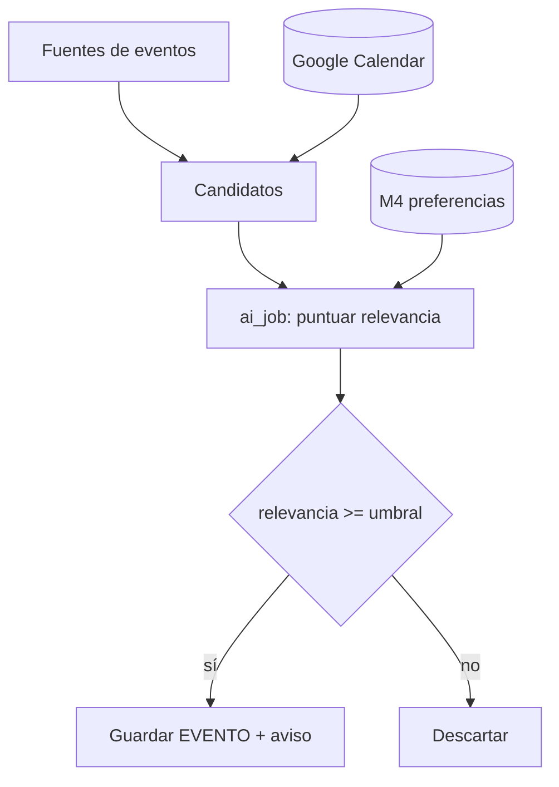

# M2 · Calendario inteligente

| Campo | Valor |
|-------|-------|
| **ID** | M2 |
| **Estado** | 🟧 borrador |
| **Depende de** | T3 (Calendar/eventos), M4 (contexto: preferencias), M6 (IA), M7 |
| **Lo usan** | M5 (dashboard) |

## 1. Propósito y alcance
Planificar **viajes y eventos** y **avisar** de eventos de interés: locales (en tu zona) o accesibles en
**remoto**. Integra Google Calendar y descubre eventos de fuentes externas, filtrados por tus preferencias
(banco de contexto).

**Dentro:** gestión de viajes/eventos; sync con Calendar; descubrimiento y scoring de eventos;
recordatorios. **Fuera:** reservas/compra de entradas (futuro).

## 2. Actores
Usuario; Worker (sync Calendar, descubrimiento, recordatorios); Agente IA (scoring, resúmenes, sugerencias).

## 3. Requisitos funcionales (RF)
| ID | Requisito | Prioridad |
|----|-----------|:---------:|
| RF-M2-001 | Gestionar viajes (idea→planificado→en curso→hecho) y sus eventos asociados. | Must |
| RF-M2-002 | Sincronizar eventos con Google Calendar (lectura; escritura opcional). | Must |
| RF-M2-003 | Descubrir eventos de interés **locales** (por ubicación) y **remotos** (online). | Must |
| RF-M2-004 | Puntuar relevancia de cada evento según preferencias (M4) y avisar solo de lo relevante. | Must |
| RF-M2-005 | Recordatorios configurables (email/push) antes de eventos. | Must |
| RF-M2-006 | Resumen IA de "qué hay esta semana" (locales + remotos relevantes). | Should |
| RF-M2-007 | Sugerir agenda al planificar un viaje (eventos en destino y fechas). | Could |

## 4. Requisitos no funcionales (RNF)
| ID | Requisito | Métrica |
|----|-----------|---------|
| RNF-M2-001 | Señal sobre ruido | Avisos relevantes; el usuario marca falsos positivos para reajustar el scoring. |
| RNF-M2-002 | Fuentes pluggables | Interfaz `EventSource` para añadir fuentes sin tocar el resto. |
| RNF-M2-003 | Sin coste IA | Scoring/resúmenes vía runner headless (suscripción). |
| RNF-M2-004 | Recordatorios fiables | Idempotentes; estado `pendiente→enviado→error`. |

## 5. Modelo de datos (fragmento)
`VIAJE`, `EVENTO`, `RECORDATORIO`. `EVENTO.fuente ∈ {manual, calendar, descubierto}`,
`modalidad ∈ {presencial, remoto, hibrido}`, `relevancia ∈ [0,1]`. Ver ER global.

## 6. Arquitectura / componentes
- `lib/email`/`lib/calendar` (en T3) → `lib/services/eventos.ts` (scoring con M4 + M6).
- Worker: jobs `syncCalendar`, `descubrirEventos`, `dispararRecordatorios`.
- UI: `app/(dashboard)/calendario` — vista de agenda, viajes, feed de descubrimientos.

## 7. Funcionalidades
- **F-M2-1 · Viajes y eventos (CRUD)** — espejo opcional en Notion (`notion_page_id`).
- **F-M2-2 · Sync Calendar** — pull de eventos; merge sin duplicar.
- **F-M2-3 · Descubrimiento + scoring** — fuentes → candidatos → la IA puntúa con preferencias (M4) → guarda los relevantes.
- **F-M2-4 · Recordatorios** — calcula y dispara avisos (email vía nodemailer / push).
- **F-M2-5 · Resumen semanal IA** — job que arma "agenda de la semana".

## 8. Endpoints / Server Actions / Jobs
| Tipo | Nombre | Entrada | Salida | Auth |
|------|--------|---------|--------|------|
| Job | `syncCalendar` | — | eventos | worker |
| Job | `descubrirEventos` | ubicación, ventana | candidatos | worker |
| Job | `dispararRecordatorios` | — | envíos | worker |
| Server Action | `crearViaje/crearEvento` | datos (Zod) | registro | usuario |
| Server Action | `feedbackRelevancia` | evento_id, útil? | ok | usuario |

## 9. Componentes UI (DoD)
| Componente | Test RTL | Estado |
|------------|:--------:|--------|
| `AgendaSemana` | ⬜ | ⬜ |
| `ListaViajes` | ⬜ | ⬜ |
| `FeedDescubrimientos` (con feedback) | ⬜ | ⬜ |
| `ConfigRecordatorios` | ⬜ | ⬜ |

## 10. Criterios de aceptación
- [ ] Los eventos de Calendar aparecen sin duplicarse.
- [ ] Solo se avisa de eventos por encima del umbral de relevancia.
- [ ] El feedback del usuario ajusta el scoring (vía preferencias en M4).
- [ ] Los recordatorios se envían una sola vez.

## 11. Riesgos y decisiones abiertas
- **Fuentes de eventos**: definir cuáles (APIs públicas, Eventbrite/Meetup/Luma, feeds locales) y su legalidad de uso.
- Definir tu **ubicación** y radios; y qué cuenta como "remoto de interés".
- Empezar simple (Calendar + 1 fuente) y ampliar.
