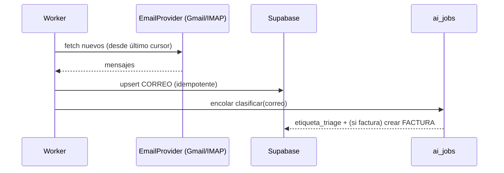

# M3 · Backoffice / triaje de correo

| Campo | Valor |
|-------|-------|
| **ID** | M3 |
| **Estado** | 🟧 borrador |
| **Depende de** | T2 (Gmail+IMAP), M6 (IA), M7 (auth/cifrado), Supabase |
| **Lo usan** | M1 (facturas → gastos), M5 (dashboard) |

## 1. Propósito y alcance
Monitorear **varias cuentas de correo** (Gmail + IMAP), clasificar lo entrante (triaje), **detectar y
extraer facturas** (→ M1) y mantener al usuario al día con un resumen.

**Dentro:** conexión multi-cuenta; polling/push; clasificación; extracción de facturas; bandeja de triaje.
**Fuera:** cliente de correo completo (no se responde correos desde aquí, salvo notificaciones del sistema).

## 2. Actores
Usuario; Worker (polling); Agente IA (clasificación + extracción).

## 3. Requisitos funcionales (RF)
| ID | Requisito | Prioridad |
|----|-----------|:---------:|
| RF-M3-001 | Conectar **varias** cuentas: Gmail (OAuth) e IMAP (dominio propio/otros). | Must |
| RF-M3-002 | Ingerir correos nuevos de todas las cuentas (idempotente por `message_id`). | Must |
| RF-M3-003 | Clasificar cada correo (factura, importante, promo, personal, etc.). | Must |
| RF-M3-004 | Detectar facturas y extraer: proveedor, importe, moneda, fechas, PDF adjunto → `FACTURA`. | Must |
| RF-M3-005 | Bandeja de triaje en la UI con acciones (marcar, descartar, forzar como factura). | Must |
| RF-M3-006 | Resumen periódico ("qué llegó importante"). | Should |
| RF-M3-007 | Reglas del usuario (remitentes de confianza, etiquetas) en M4. | Should |

## 4. Requisitos no funcionales (RNF)
| ID | Requisito | Métrica |
|----|-----------|---------|
| RNF-M3-001 | Seguridad de credenciales | Tokens/passwords **cifrados** en Supabase (AES-256-GCM); nunca en `.env` ni en texto plano. |
| RNF-M3-002 | Idempotencia | Único `(cuenta_id, message_id)`; reprocesar no duplica. |
| RNF-M3-003 | Aislamiento de proveedores | Interfaz común `EmailProvider`; Gmail e IMAP intercambiables. |
| RNF-M3-004 | Privacidad | Se guardan metadatos + lo necesario; el cuerpo crudo se trata con cuidado (retención configurable). |

## 5. Modelo de datos (fragmento)
`CUENTA_CORREO`, `CORREO`, `FACTURA`. Ver ER global. La extracción de factura crea `FACTURA` ligada al `CORREO`.

## 6. Arquitectura / componentes
- `lib/email/gmail` + `lib/email/imap` (impl. `EmailProvider`) + `lib/email/parsers`.
- `lib/services/triaje.ts` — orquesta ingest → clasifica (encola `ai_job`) → extrae factura.
- Worker: job `pollearCorreo` (todas las cuentas).
- UI: `app/(dashboard)/backoffice` — bandeja de triaje.

## 7. Funcionalidades
- **F-M3-1 · Conectar cuenta** — Gmail OAuth (guardar refresh_token cifrado) / IMAP (host/user/app-password cifrados).
- **F-M3-2 · Polling e ingest** — recorre cuentas, upsert `CORREO` idempotente.
- **F-M3-3 · Clasificación IA** — `ai_job` etiqueta el correo (con reglas de M4).
- **F-M3-4 · Extracción de factura** — `ai_job` extrae campos + adjunto → `FACTURA` → dispara conciliación (M1).
- **F-M3-5 · Bandeja de triaje** — UI con acciones y correcciones (feedback para reglas).

## 8. Endpoints / Server Actions / Jobs
| Tipo | Nombre | Entrada | Salida | Auth |
|------|--------|---------|--------|------|
| Server Action | `conectarCuentaGmail` | OAuth code | cuenta | usuario |
| Server Action | `conectarCuentaImap` | host/user/pass (Zod) | cuenta | usuario |
| Job | `pollearCorreo` | — | upserts | worker |
| Server Action | `accionTriaje` | correo_id, acción | ok | usuario |

## 9. Componentes UI (DoD)
| Componente | Test RTL | Estado |
|------------|:--------:|--------|
| `BandejaTriaje` | ⬜ | ⬜ |
| `TarjetaCorreo` (acciones) | ⬜ | ⬜ |
| `ConectarCuentaForm` | ⬜ | ⬜ |
| `ResumenBackoffice` | ⬜ | ⬜ |

## 10. Criterios de aceptación
- [ ] Varias cuentas (Gmail+IMAP) ingieren sin duplicar.
- [ ] Las credenciales se guardan cifradas (verificable: no hay texto plano en BD).
- [ ] Una factura detectada genera `FACTURA` y dispara la conciliación de M1.
- [ ] El usuario puede corregir el triaje y eso alimenta las reglas (M4).

## 11. Riesgos y decisiones abiertas
- **Gmail API**: verificación de la app de Google Cloud y scopes (`gmail.readonly`); refresh tokens por cuenta.
- **IMAP**: app-passwords por proveedor; manejo de carpetas.
- Decidir **retención** del cuerpo de los correos (privacidad vs. utilidad para la IA).
