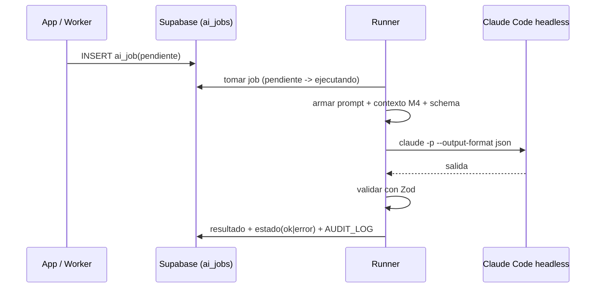

# M6 · Asistente IA / orquestación (jobs headless)

| Campo | Valor |
|-------|-------|
| **ID** | M6 |
| **Estado** | 🟦 MVP implementado (Fases 0–4); pendiente Fase 5 |
| **Depende de** | M4 (contexto), M7, Supabase, Claude Code headless |
| **Lo usan** | M1 (conciliación), M2 (scoring/resúmenes), M3 (clasificación/extracción) |

> **Estado de implementación (2026-06-23).** Hecho: cola `ai_jobs` (claim atómico), runner headless
> (contexto M4 + validación Zod + reintentos/backoff), burbuja de chat (`consulta_rag`, polling),
> proponer contexto (`proponer_contexto` + `SuggestionCard`), gobernanza M4↔M6. Migraciones `0005`/`0006`.
> **Pendiente (Fase 5):** rotación de `CLAUDE_CODE_OAUTH_TOKEN` desde la app (cifrada) + banner de estado
> (RF-M6-013); observabilidad de jobs en el dashboard (RF-M6-006, parte UI). Mejoras: "Revisar y publicar"
> abriendo el editor M4 precargado; intención preguntar/enseñar por clasificación del modelo (hoy heurística).

## 1. Propósito y alcance
Capa de IA **agnóstica al motor**: la app encola tareas en `AI_JOB`; el **worker** las ejecuta con
**Claude Code headless** usando tu **suscripción** (sin API key). Define los **contratos de tarea**
(entrada/salida con Zod), el runner y el manejo de errores/reintentos.

**Dentro:** cola de jobs, runner headless, contratos por tipo de tarea, validación de salida, reintentos,
la **burbuja de chat** (UI del asistente) y la **propuesta de borradores** para el banco de contexto (M4).
**Fuera:** la lógica de cada dominio (vive en M1/M2/M3). La **publicación/curaduría** del conocimiento es
del usuario (M4): la IA solo crea borradores.

> **Gobernanza M4↔M6 (principio).** La IA **lee** borradores y publicados, pero **decide solo con lo
> publicado** (`recuperar_contexto` ya filtra `estado='publicado'` + vigente). **Escribe** únicamente
> borradores; **publicar es siempre acción del usuario.**

## 2. Actores
App web (encola); Worker/Runner (ejecuta); Claude Code headless (motor).

## 3. Requisitos funcionales (RF)
| ID | Requisito | Prioridad |
|----|-----------|:---------:|
| RF-M6-001 | Encolar tareas tipadas en `AI_JOB` (tipo, payload validado). | Must |
| RF-M6-002 | Runner que toma jobs `pendiente`, invoca `claude -p --output-format json` y persiste resultado. | Must |
| RF-M6-003 | Contratos por tipo: `clasificar_correo`, `extraer_factura`, `conciliar_gasto`, `puntuar_evento`, `resumen_semana`, `consulta_rag`. | Must |
| RF-M6-004 | Validar la salida con Zod antes de escribir; si no valida → `error` reintentable. | Must |
| RF-M6-005 | Inyectar contexto de M4 en el prompt (recuperación selectiva). | Must |
| RF-M6-006 | Reintentos con backoff y límite; visibilidad del estado en el dashboard. | Should |
| RF-M6-007 | Modo "API key" enchufable (cambiar solo el runner) si se necesita robustez 24/7. | Could |
| RF-M6-008 | **Burbuja de chat** flotante (FAB) como UI del asistente; consume `consulta_rag`. | Must |
| RF-M6-009 | **Proponer/crear contexto**: tarea `proponer_contexto` → borrador(es) de `EntradaContexto`; **nunca publica**. | Must |
| RF-M6-010 | Lectura de borradores solo para *awareness* (mostrar/evitar duplicados), **separada** de la recuperación de decisión (que es solo publicado). | Must |
| RF-M6-011 | Cada sugerencia ofrece **Revisar y publicar** / **Guardar como borrador** / **Descartar**. | Must |
| RF-M6-012 | Auth del runner por **`CLAUDE_CODE_OAUTH_TOKEN`** (`claude setup-token`, ~1 año, suscripción). | Must |
| RF-M6-013 | **Rotación de token desde la app**: campo admin que guarda el token **cifrado** (lo lee el runner) + **banner de estado** del asistente si falla la auth. | Should |

## 4. Requisitos no funcionales (RNF)
| ID | Requisito | Métrica |
|----|-----------|---------|
| RNF-M6-001 | Coste = 0 (suscripción) | El runner por defecto usa Claude Code, sin `ANTHROPIC_API_KEY`. |
| RNF-M6-002 | Idempotencia | Reejecutar un job no duplica efectos (claves naturales en los writes). |
| RNF-M6-003 | Aislamiento | El runner corre en su propio proceso/contenedor; la app no se bloquea. |
| RNF-M6-004 | Trazabilidad | `AI_JOB.payload`/`resultado` guardan contexto usado y salida. |

## 5. Modelo de datos (fragmento)
`AI_JOB` (cola). Ver ER global.

## 6. Arquitectura / componentes
- `lib/ai/jobs` — `encolar(tipo, payload)`, `tomarSiguiente()`, `marcar(estado)`.
- `lib/ai/runner` — construye prompt (instrucciones + contexto M4 + esquema de salida), invoca Claude Code, parsea/valida.
- `worker/` — loop/cron que drena la cola.

## 7. Funcionalidades
- **F-M6-1 · Cola de jobs** (encolar/tomar/marcar).
- **F-M6-2 · Runner headless** (contrato job↔Claude Code, parseo JSON, validación).
- **F-M6-3 · Catálogo de tareas** (un esquema Zod entrada/salida por tipo).
- **F-M6-4 · Reintentos y observabilidad**.
- **F-M6-5 · Burbuja de chat** (FAB + panel/sheet; en móvil **encima de la bottom nav**; consume
  `consulta_rag`; la respuesta llega por **polling corto** en el MVP (Realtime como mejora futura)).
- **F-M6-6 · Sugerir/crear contexto** (tarea `proponer_contexto`; **tarjeta de sugerencia** con
  *Revisar y publicar* / *Guardar como borrador* / *Descartar*; la IA escribe **solo borradores**).

## 8. Contratos de tarea (resumen)
| Tipo | Entrada | Salida |
|------|---------|--------|
| `clasificar_correo` | correo (asunto, remitente, cuerpo) | etiqueta + es_factura + confianza |
| `extraer_factura` | correo + adjunto | proveedor, importe, moneda, fechas |
| `conciliar_gasto` | factura + candidatos | gasto_id o "crear" |
| `puntuar_evento` | evento + preferencias (M4) | relevancia [0,1] + motivo |
| `resumen_semana` | eventos de la ventana | texto resumen |
| `consulta_rag` | pregunta + contexto (M4, **solo publicado**) | respuesta + fuentes |
| `proponer_contexto` | petición/observación + contexto actual | borrador(es) de `EntradaContexto` (tipo, título, contenido, tags, vigencia) |

## 8.1 Banco de contexto (M4): gobernanza del asistente
Dos rutas de lectura **separadas** para que los borradores nunca dirijan decisiones:
- `recuperarContexto` → **solo publicado + vigente** → **alimenta los prompts de decisión** (`consulta_rag`).
- `listarContexto({ estados })` → incluye borradores → **solo para mostrar/curar** (awareness, evitar
  duplicados); **jamás** entra al prompt de razonamiento.

Escritura: la IA crea entradas con `estado='borrador'` (reusa `guardarEntrada`, que ya default-ea a
borrador). **Publicar es acción del usuario** (`cambiarEstado`). Flujo de la sugerencia:
- Pedido explícito ("creá una regla …") → crea el borrador y avisa.
- Sugerencia propia de la IA → muestra la tarjeta; el usuario elige **Revisar y publicar** (abre el
  editor de M4 precargado → publica), **Guardar como borrador** (persiste sin publicar) o **Descartar**.

## 9. Criterios de aceptación
- [ ] Un job recorre `pendiente→ejecutando→ok` y persiste salida validada.
- [ ] Salida no conforme → `error` reintentable, sin escribir basura.
- [ ] El runner por defecto **no** usa API key (usa Claude Code/suscripción).
- [ ] El contexto inyectado proviene de M4 y queda trazado.
- [ ] La recuperación de decisión devuelve **solo** publicado+vigente; los borradores nunca entran al prompt.
- [ ] La IA crea **borradores**; ninguno queda publicado sin acción del usuario.
- [ ] La burbuja responde una `consulta_rag` end-to-end **con fuentes** (citando entradas de M4).
- [ ] Cada sugerencia ofrece **Revisar y publicar** / **Guardar como borrador** / **Descartar**.

## 10. Riesgos y decisiones abiertas
- **Auth headless en VPS 24/7 — RESUELTO:** runner en el **worker del VPS** con
  `CLAUDE_CODE_OAUTH_TOKEN` (`claude setup-token`, token de ~1 año, suscripción → coste 0). El token se
  genera localmente y se rota ~anualmente; la app expone un **campo admin (cifrado) + banner de estado**
  para rotarlo sin SSH ni redeploy. No hay re-login automático desde la app (el OAuth es interactivo,
  atado a la cuenta Anthropic). **Plan B:** `ANTHROPIC_API_KEY` (sin expiración, pago por token) —
  enchufable cambiando solo el runner (RF-M6-007).
- **Entrega de respuesta:** **polling corto** en el MVP; Supabase Realtime como mejora.
- Definir formato exacto de invocación de Claude Code (flags, `--output-format json`, system prompt, skills disponibles para el agente).
- Concurrencia del runner (cuántos jobs en paralelo sin saturar).
