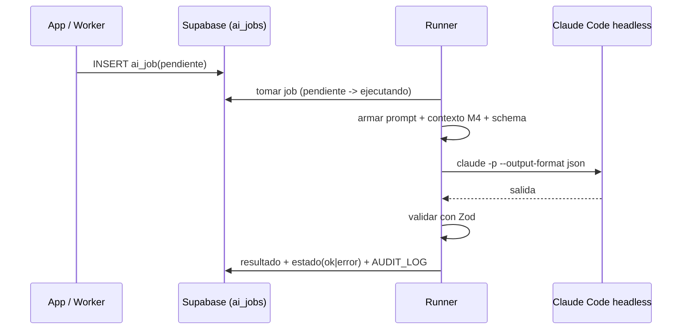

# M6 · Asistente IA / orquestación (jobs headless)

| Campo | Valor |
|-------|-------|
| **ID** | M6 |
| **Estado** | 🟧 borrador |
| **Depende de** | M4 (contexto), M7, Supabase, Claude Code headless |
| **Lo usan** | M1 (conciliación), M2 (scoring/resúmenes), M3 (clasificación/extracción) |

## 1. Propósito y alcance
Capa de IA **agnóstica al motor**: la app encola tareas en `AI_JOB`; el **worker** las ejecuta con
**Claude Code headless** usando tu **suscripción** (sin API key). Define los **contratos de tarea**
(entrada/salida con Zod), el runner y el manejo de errores/reintentos.

**Dentro:** cola de jobs, runner headless, contratos por tipo de tarea, validación de salida, reintentos.
**Fuera:** la lógica de cada dominio (vive en M1/M2/M3); la edición del conocimiento (M4).

## 2. Actores
App web (encola); Worker/Runner (ejecuta); Claude Code headless (motor).

## 3. Requisitos funcionales (RF)
| ID | Requisito | Prioridad |
|----|-----------|:---------:|
| RF-M6-001 | Encolar tareas tipadas en `AI_JOB` (tipo, payload validado). | Must |
| RF-M6-002 | Runner que toma jobs `pendiente`, invoca `claude -p --output-format json` y persiste resultado. | Must |
| RF-M6-003 | Contratos por tipo: `clasificar_correo`, `extraer_factura`, `conciliar_gasto`, `puntuar_evento`, `resumen_semana`, `consulta_rag`. | Must |
| RF-M6-004 | Validar la salida con Zod antes de escribir; si no valida → `error` reintentable. | Must |
| RF-M6-005 | Inyectar contexto de M4 en el prompt (recuperación selectiva). | Must |
| RF-M6-006 | Reintentos con backoff y límite; visibilidad del estado en el dashboard. | Should |
| RF-M6-007 | Modo "API key" enchufable (cambiar solo el runner) si se necesita robustez 24/7. | Could |

## 4. Requisitos no funcionales (RNF)
| ID | Requisito | Métrica |
|----|-----------|---------|
| RNF-M6-001 | Coste = 0 (suscripción) | El runner por defecto usa Claude Code, sin `ANTHROPIC_API_KEY`. |
| RNF-M6-002 | Idempotencia | Reejecutar un job no duplica efectos (claves naturales en los writes). |
| RNF-M6-003 | Aislamiento | El runner corre en su propio proceso/contenedor; la app no se bloquea. |
| RNF-M6-004 | Trazabilidad | `AI_JOB.payload`/`resultado` guardan contexto usado y salida. |

## 5. Modelo de datos (fragmento)
`AI_JOB` (cola). Ver ER global.

## 6. Arquitectura / componentes
- `lib/ai/jobs` — `encolar(tipo, payload)`, `tomarSiguiente()`, `marcar(estado)`.
- `lib/ai/runner` — construye prompt (instrucciones + contexto M4 + esquema de salida), invoca Claude Code, parsea/valida.
- `worker/` — loop/cron que drena la cola.

## 7. Funcionalidades
- **F-M6-1 · Cola de jobs** (encolar/tomar/marcar).
- **F-M6-2 · Runner headless** (contrato job↔Claude Code, parseo JSON, validación).
- **F-M6-3 · Catálogo de tareas** (un esquema Zod entrada/salida por tipo).
- **F-M6-4 · Reintentos y observabilidad**.

## 8. Contratos de tarea (resumen)
| Tipo | Entrada | Salida |
|------|---------|--------|
| `clasificar_correo` | correo (asunto, remitente, cuerpo) | etiqueta + es_factura + confianza |
| `extraer_factura` | correo + adjunto | proveedor, importe, moneda, fechas |
| `conciliar_gasto` | factura + candidatos | gasto_id o "crear" |
| `puntuar_evento` | evento + preferencias (M4) | relevancia [0,1] + motivo |
| `resumen_semana` | eventos de la ventana | texto resumen |
| `consulta_rag` | pregunta + contexto (M4) | respuesta + fuentes |

## 9. Criterios de aceptación
- [ ] Un job recorre `pendiente→ejecutando→ok` y persiste salida validada.
- [ ] Salida no conforme → `error` reintentable, sin escribir basura.
- [ ] El runner por defecto **no** usa API key (usa Claude Code/suscripción).
- [ ] El contexto inyectado proviene de M4 y queda trazado.

## 10. Riesgos y decisiones abiertas
- **Fiabilidad headless en VPS 24/7** (login/ToS): mitigación = runner en tu máquina; modo API key enchufable.
- Definir formato exacto de invocación de Claude Code (flags, `--output-format json`, system prompt, skills disponibles para el agente).
- Concurrencia del runner (cuántos jobs en paralelo sin saturar).
